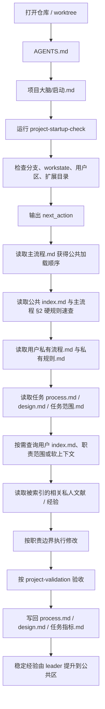
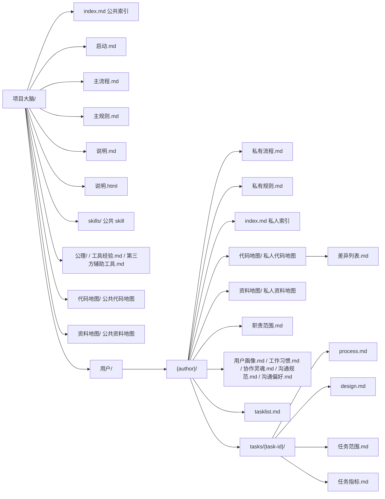
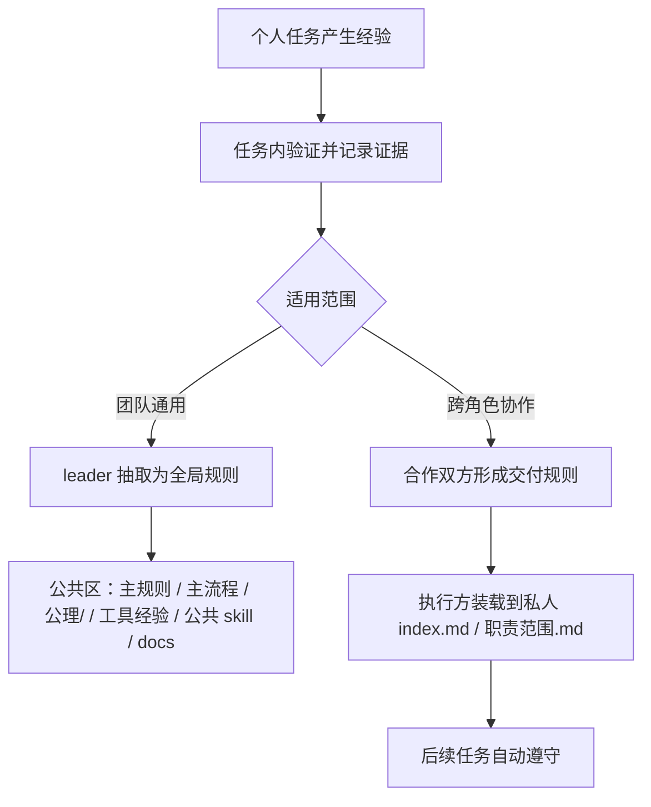

# 项目大脑说明

本文是项目大脑的设计指导思想和 Markdown 说明正文。它不只是汇报稿备份，也用来沉淀这套系统为什么存在、按什么原则运转、遇到分歧时应该优先保护什么。`说明.html` 负责视觉化审阅和演示；本文负责让 agent、成员和后续 diff 能直接读取同一套思想和内容。

## 设计指导思想

项目大脑的核心判断是：AI 协作不是把更多上下文塞进一次聊天，而是把正确的信息放到正确的位置，让下一次会话、另一个 worktree、另一个成员还能稳定接上。

这套系统优先保护以下原则：

- 信息要有归属：团队共识进公共区，个人长期上下文进私人区，任务过程进任务区，稳定代码规则进 docs。
- 私有区要隔离：所有 author 都不能直接修改其他 author 的私人用户区；跨角色规则由对方确认后装载。
- 扩展创建要私有优先：新建 skill、MCP、hook 和辅助落盘默认先放当前 author 私有区；只有 leader 公共化流程能放到私有区外。
- 职责越界要拒绝：用户请求突破当前 author 职责范围时，agent 先明确拒绝并说明风险；用户坚持时，先确认是否修改职责范围/修改边界，再记录风险并继续。
- 职责范围可主动同步：当前 author 可以基于已达成共识的交付规则文档，要求项目大脑把允许目录、文件类型、脚本范围、禁止事项和风险同步到自己的私人 `职责范围.md`。
- 信息要能生长：每个 author 的经验不同；总结触发后默认落到当前 author 私人 `经验/`，同步私人 `index.md`，后续按需查阅；用户单独要求整理经验时先开独立临时整理任务，只提交整理结果，结果 push 到 `main` 后再清理临时任务；稳定经验再由 leader 抽取为公共规则或公共 skill。
- 整理要能校准：整理前先加载私人整理经验和公共整理共识；整理后输出求证文档，请使用者校准重要/不重要的标准、关注点、措辞、结构、可读性技巧和模块理解方法。
- 规则要有共识：全局规则来自个人区经验抽取；交付规则来自合作双方确认，由执行方装载到私人区后长期生效。
- 文档要分层：流程和规则文档要短、准、无歧义；`主流程.md` 是 Runtime Hub（加载 + §2 硬规则速查），`主规则.md` 是 Rules Detail Pack（按需读的 L3 详情），细节交给 skill reference。
- 索引要分级：多级索引拆解和归类是一套通用方法论；公共和私人一级 `index.md` 都只做入口，经验、公理、代码地图、资料地图、会议资料和设计资料也按同一原则分级归类。
- 加载要分层：公共 `主流程.md` / `主规则.md` 只管团队共享层；加载完公共层后进入当前 author 的 `私有流程.md` / `私有规则.md`，再加载当前任务上下文；私人索引、私人经验、职责和软上下文按触发场景读取。
- 找代码要先做查询规划：搜索代码、调研相似功能、定位入口或评估复用前，先查当前 author 私人 `代码地图/` 和 `差异列表.md`，再查公共 `代码地图/`；读完地图后产出查询规划卡，再带地图锚点用 CodeGraph / 限定目录 `rg` 验证。稳定结论只回写当前 author 私人代码地图和 `差异列表.md`。
- 找资料也先看地图：搜索文档、配置、脚本、表格、静态资源、会议记录、设计思路或外部资料前，先查当前 author 私人 `资料地图/`，再查公共 `资料地图/`；普通搜索后只回写当前 author 私人资料地图。
- 启动要渐进：agent 先识别当前操作者和当前任务，再按需要读取索引、职责、过程、设计、skill 和文档，避免冷启动就加载过多无关内容。
- 恢复要重载：新会话、上下文压缩后、长时间运行后、任务恢复后，都要回到落盘文件重新确认目标、决策、范围、索引和相关知识库；项目级启动/压缩 hook 只负责提醒或在工具支持时注入重载提示，不替代真实读取。
- 工作位置按风险决定：会议纪要、设计讨论和小范围改动默认可在 main 工作；只有未提交改动可能冲突、多人并行、主线可能长时间不稳定，或需要独立试验/交接时才创建 worktree。启动时必须显示当前位置和“主工作区 / 独立任务副本”。
- 推送要可证明：任何非技术人员说“提交到分支”时只做本地保存；说“提交到 main”“push main”“推送 main”“推送主干”或仅说“推送”时，默认保存当前 task 已验证改动并上传远端 main，不再额外追问“是否先提交”。仍须用 `perfect-push` 证明远端 main 实际包含当前 `HEAD`；只有后验通过才能说“已经成功 push main，推送到远端了，别人可以看到了”。
- 大需求要拆阶段：需求很大、边界不清、跨模块或评估复杂时，先梳理目标和边界，查相似实现，拆阶段、定每阶段验收，再一阶段一阶段推进。
- 代码要可预测：代码规范、防御式编程、术语统一和日志第一现场都是项目大脑的一部分，目标是减少搜索次数，提高定位命中率。
- 完成要可验证：任务不能只停在“我做完了”，必须有范围、验证方法、证据和失败归因。

## 为什么现在必须做

团队的目标是用 AI 提升协作与交付效率。项目大脑不是为了多写文档，而是因为 AI 协作已经进入规模化阶段，光靠聊天和搜索开始撑不住。

AI 干活越来越慢。它明明很卖力，但代码库越来越大、低可预测代码越来越多，它就越来越看不懂、越来越搜不出来。搜不到已有能力，它就会重复造轮子，继续堆高复杂度，形成恶性循环。

AI 越来越容易跑偏。AI 如果看不到人类的设计思路，或者没有正确检索到相关文档，就会开始乱脑补，把需求边界越扩越大，混淆概念。结果可能是交付方向完全错误，或者擅自加很多没有要求的特性，让代码失控膨胀，产出不符合要求。

并行开发容易冲突。多人、多 worktree、多 AI 会话同时推进时，如果没有共同的任务状态和边界，改动会互相覆盖，提交时也更容易打架。

职责边界不清晰，容易提交冲突。AI 不知道当前使用者负责什么，就可能改到不该改的地方；使用者本来也不负责那块，自然看不懂，只能被迫提交，最后和别人的改动冲突，甚至让设计思路背道而驰。

“完成了”不等于测过。AI 如果不知道怎样理解使用者的真实验收标准，就会自己脑补检查项；它说完成了，可能只是它以为完成了。

经验如果只留在聊天里，即使不切窗口，也会因为上下文压缩或长时间运行丢失判断、约束和踩坑信息。下一次会话还会反复踩同一个坑，甚至做出和旧决策矛盾的新判断，继续浪费时间和 token。

## 这套系统解决什么

项目大脑把团队里的人、agent、需求、知识库和经验串起来，让一次工作能被恢复、被验证、被交接、被沉淀。

它要解决的不是“文件放哪里”这个表面问题，而是四件更底层的事：

- 入口简洁：所有 agent 从 `AGENTS.md` 进入，再按 `启动.md` 找到当前操作者和当前任务。
- 方向单一：`启动.md` 拉起 `主流程.md`，`主流程.md` 只说明启动完成后的文档加载顺序，不反向索引或解释 `启动.md`。
- 状态清晰：`project-startup-check` 用 Python 校验 `workstate.json`、用户区、当前 author 私有扩展目录和当前任务指针，并输出启动阶段、用户描述和任务目录，让人核对 agent 没有认错用户或任务。
- 边界明确：私人 `私有流程.md` / `私有规则.md` 承接公共加载，`职责范围.md` 控制当前操作者能改什么；越界请求先拒绝和说明风险；公共规则和交付规则控制跨角色协作。
- 验收可追踪：任务目录记录过程、决策、范围、指标和验证证据，“完成”必须对应真实验收。

## 使用者每天怎么用

日常体验应该很短：进入仓库后，agent 先输出“开始启动项目大脑”，运行 `project-startup-check`，用脚本确认当前操作者是谁、当前任务是什么，并补齐启动所需目录。然后它明确提示“开始加载公共流程和规则”“开始加载某个用户的私有流程和规则”“开始加载某个任务的上下文”，读完后输出“加载结束，可以开始工作了”。如果经历上下文压缩、长时间运行或任务恢复，它必须重新读取 `process.md`、`design.md`、`任务范围.md`、`任务指标.md` 和用户私有流程/规则，先稳定目标与约束；Codex 通过 `SessionStart(startup|resume|clear|compact)` 注入启动/重载提示，Cursor 只能在 `preCompact` 显示用户提醒，它们都不替代读取动作。需要私人文献、经验、职责或软上下文时，再按需查询私人索引和相关知识库。接着它按边界执行，按验收流程检查，最后把过程、决策、证据和经验写回仓库。

这套流程的重点是减少临场猜测。不是每次都重新搜索全仓库，也不是每次都重新解释团队规则，而是把上下文恢复变成固定路径。

## 私有流程加载顺序与机制

`project-startup-check` 只负责校验仓库入口、`workstate.json`、当前 author 用户区、私有扩展目录和当前任务指针，并输出 `next_action`。当输出为 `read_current_task_then_main_flow` 时，agent 必须继续执行文档加载链：先按 `主流程.md` 读取公共 `index.md` 和 **§2 硬规则速查**（不读 `主规则.md` 全文），再读取当前 author 的 `私有流程.md`。脚本不会替 agent 把所有私有上下文读完；真正的加载动作由 agent 按流程文档执行。

当前 author 的 `私有流程.md` 固定按下列顺序加载必读上下文。私人 `index.md` 可能很大，只作为私人文献索引；需要查找私人资料、经验、方法、交付规则或常用文档时，才按需查询相关条目并读取被索引文档。

| 顺序 | 读取内容 | 作用 |
| --- | --- | --- |
| 1 | `私有规则.md` | 当前 author 长期私有规则，只补充私人区和任务区，不覆盖公共主规则。 |
| 2 | 当前任务 `process.md` | 恢复用户需求、过程、验证、风险和下一步。 |
| 3 | 当前任务 `design.md` | 恢复本任务稳定设计决策和原因。 |
| 4 | 当前任务 `任务范围.md` | 恢复工作项、状态、验证方法和证据。 |
| 5 | 当前任务 `任务指标.md` | 恢复验收质量、失败归因和阶段指标。 |

这条链路的设计目标是：公共规则先统一团队底线，私有流程再补当前 author 的个人规则和任务状态。职责范围、软上下文、私人索引和经验文档是条件加载，不进入冷启动必读链路。压缩后、长时间运行后、恢复旧任务、阶段验收或提交前，都要先从必读链路恢复上下文，再按触发场景查私人索引或相关文档。

## 工作结构

公共区保存团队共享的入口、规则、流程、已公共化 skill 和可复用经验。私人区保存当前操作者自己的私有流程、私有规则、索引、职责边界、偏好、任务列表、私有 skills / mcps / hooks 和任务过程。任务区按具体任务拆开，避免多个 worktree 或多个任务互相覆盖。

私人 `私有流程.md` / `私有规则.md` 结构和公共 `主流程.md` / `主规则.md` 相似，但只服务当前 author。私人流程的必读链路不读取私人 `index.md` 全文；它只提示需要私人文献时去按需查询索引，再读取被索引的 `经验/{主题}.md`、交付规则、常用资料或其他私人文档。私人 `index.md` 默认只管私人区基础入口，不重复写公共 `index.md`、启动文件、主流程、主规则或公共 skill 清单。公共内容已经在启动后先加载；只有用户主动要求加入、或任务中确认对当前 author 高频有用的公共区域资料、根目录资料或 `docs/` 文档，才作为快速入口追加到私人索引。

私人 `经验/` 是当前 author 的任务经验库和方法索引库，对应“预制菜”里公理/教训沉淀的私人层。每个 author 的经验不同，不能互相默认替代。它可以保存历史教训，也可以保存测试方法、环境搭建、需求梳理、写文档、调试、需求拆解、按需加载入口、checklist 和模板。用户说“总结”“记住”“下次要/不要”、多轮纠错后满意，或指出后续做法时，agent 通过 `summarize-private-experience` 从当前任务记录提炼经验，按主题聚类写入当前 author 的 `经验/`，再把“遇到什么情况看它 + 前因 + 结论”写入当前 author 私人 `index.md`。用户单独要求“整理经验”时，必须先新建独立临时整理任务，不把它当作继续旧任务；整理完成后只提交和 push 经验文档、私人索引等结果，临时任务目录和 `tasklist.md` 对应行不 commit、不 push。通常等结果 push 到 `main` 后再清理临时任务，以便整理不好时返工；其他任务目录不准删除。后续需要同类经验时按需查索引和主题文档，不全量加载私人 `index.md` 或 `经验/`。不能一条经验一个文件。

经验整理必须先评判再沉淀。`summarize-private-experience/references/experience-curation-standards.md` 定义长期价值、证据闭环、L0/L1/L2/L3 分层和丢弃标准；`experience-evaluation.md` 定义收录、索引、候选和丢弃评分。没有来源、前因、结论、证据或复用场景的流水账不进入经验库；原始文档已经完整时可以只写索引；总结文档和索引摘要都必须写清前因后果。

整理功能早期要把“整理能力”本身当成可学习对象。`private-experience-curation` 和 `leader-public-curation` 在整理前先查当前 author 私人 `index.md`，读取整理经验、经验沉淀、项目大脑、文档结构、可读性、模块理解方法等相关私人主题；再查公共 `公理/index.md` 中相关整理共识。整理完成后必须输出求证文档：私人整理写 `经验/整理确认.md`，leader 公共抽取写 `经验/leader整理确认.md`。有把握的整理点只列清单；不确定的点要标出不确定原因、依据缺口和需要使用者指导的问题。求证重点包括哪些重要、哪些不重要，应该更关注什么，措辞是否合适，结构是否清楚，怎样让人类更快看懂，以及对相关模块的理解是否正确。用户纠正后的整理方法先沉淀到当前 author 私人经验里。

`private-experience-curation` 只编排当前 author 私人整理：每天最多两次、间隔至少 8 小时；到期先抢 `私人整理状态.md` 的 running 锁，抢到锁后在 `{author}整理` 专用 worktree 开后台子 agent，不阻塞主任务。`leader-public-curation` 只由 `tech-lead` 使用：每天最多一次；到期先抢 `leader整理状态.md` 的 running 锁，再在 `tech-lead整理` worktree 从成员私人经验、代码地图差异和资料地图里抽取公共 `公理/`、`代码地图/`、`资料地图/`。整理完成后提交并 push 整理分支，是否进入 main 仍要问用户。

私人 `代码地图/` 是当前 author 的代码查询规划层。搜索代码、调研相似功能、定位入口或评估复用前，先查当前 author 私人代码地图和 `差异列表.md`，再查公共代码地图；读完地图后必须产出查询规划卡，列出候选入口/目录、关键词/别名、反向追踪路径、排除项和待验证问题。CodeGraph 和 `rg` 只负责带地图锚点验证源码：CodeGraph 验调用链和影响面，`rg` 在候选目录内找配置、文案、资源或非符号文件。找到稳定入口后，只回写当前 author 私人主题文档；如果公共地图缺失、过期或冲突，写入当前 author `代码地图/差异列表.md`。公共 `代码地图/` 由 leader 周期抽取，不直接承载每个人的临时搜索过程。

私人 `资料地图/` 是当前 author 的非代码项目资料位置知识库。搜索文档、配置、脚本、表格、静态资源、会议记录、设计思路或外部资料时，先查当前 author 私人资料地图，再查公共资料地图；如果都没有命中，再查公共/私人索引、`docs/`、外部资料目录、资源目录或普通 `rg`。资料地图只记录“在哪里、用什么关键词、沿哪条入口找”，不复制正文，不记录行号。公共 `资料地图/` 由 leader 从私人沉淀中抽取。

这不是把信息藏得更深，而是把信息放回它应该在的位置：团队共识进公共区，个人偏好进私人区，任务过程进任务区，稳定代码规范进 docs。

## 索引如何分级

多级索引拆解先使用 `index-tiering-methodology` 判断分类、层级和命名。它适用于公共/私人 `index.md`，也适用于 `经验/`、`公理/`、`代码地图/`、`资料地图/`、会议资料、顶层设计和设计资料等增长型知识库。

公共 `项目大脑/index.md` 和每个 author 的私人 `index.md` 都是一级入口。一级索引新增入口后将超过 50 条，或已经超过 50 条时，使用 `project-index-maintenance` 执行脚本化检查和自动分级：一级索引只保留分类入口，具体文档、目录或 skill 入口写入二级索引。超过 50 条本身不是错误；不能自动判断分类时，才停下来让人确认。

二级索引位置固定：公共二级索引放 `项目大脑/索引/{category}.md`，私人二级索引放 `项目大脑/用户/{author}/索引/{category}.md`。分类名要稳定、短、可预测，例如“会议资料”“顶层设计”“公共skills”“私人经验”“交付规则”；不要按日期、任务编号或单条文档名建分类。

相关文档也要按分类整理到子文件夹。已有明确归属的目录不强行移动，例如 `docs/meeting/`、`docs/顶层设计/`、私人 `经验/`、`tasks/`。这个规则的目标是让索引随着项目变大仍然能被快速读懂，避免一级入口变成无法加载的大清单。

## 代码地图如何工作

代码地图是一套“搜索前的查询规划层”。它不是替代 `rg` 或 CodeGraph，也不是工具排队清单，而是在第一轮工具查询前先缩小范围：先知道可能在哪个模块、哪些文件、哪些协议、哪些配置、哪些函数或相似功能附近找，并把这些线索写成查询规划卡。

公共代码地图放 `项目大脑/代码地图/`，服务所有 author，由 leader 从私人代码地图、差异列表、任务记录和稳定复盘中抽取。私人代码地图放 `项目大脑/用户/{author}/代码地图/`，服务当前 author；每次带查询规划卡验证代码、调研相似功能、定位入口或评估复用后，如果得到稳定结论，就回写当前 author 私人代码地图。

固定方法是：当前 author 私人 `代码地图/index.md` 和 `差异列表.md` -> 公共 `代码地图/index.md` -> 产出查询规划卡 -> 带地图锚点用 CodeGraph / 限定目录 `rg` 验证。固定写入边界是：日常任务只写当前 author 私人代码地图和差异列表，不直接写公共代码地图。私人和公共不一致时，私人地图可先作为搜索假设，但必须在差异列表里写明差异类型、证据和更新时间；leader 公共化时先核实差异，再更新公共地图。

代码地图主题文档按业务域或技术域聚类，不按一次搜索建文件。每个主题记录最后更新时间、最后验证版本、适用场景、关键入口、关键词/别名、反向追踪路径、误入相似目标、踩坑/捷径、相关主题和来源任务。关键入口只写文件路径和稳定符号名，例如函数、类、变量、协议、配置或数据表；不写行号，因为行号最容易漂移。

开发新需求前要先查代码地图和相似实现：能复用旧能力就复用，能小幅扩展就小幅扩展，不重复造轮子。地图结论是搜索假设，不是最终事实；发现私人地图记录和最新代码不一致时，以源码为准，更新当前 author 私人主题文档的验证版本、更新时间和入口说明；发现公共地图缺失或过期时，更新当前 author 私人差异列表，供 leader 抽取。

## 资料地图如何工作

资料地图是代码地图的补充，覆盖仓库里不属于代码定位的资料：文档、配置、脚本、表格、静态资源、会议记录、设计思路、云文档和外部来源。它的目标不是保存资料正文，而是让 agent 在搜索前知道应该先去哪里看，避免每次从全仓库扫描开始。

固定搜索顺序是：当前 author 私人 `资料地图/index.md` -> 公共 `资料地图/index.md` -> 公共/私人 `index.md` -> `docs/`、外部资料目录、资源目录或普通 `rg`。固定写入边界是：日常任务只写当前 author 私人资料地图；公共资料地图由 leader 周期抽取。

资料地图主题文档按业务域或资料类型聚类，例如“文档与会议”“配置与表格”“脚本与回调”“静态资源”“设计思路”。每条记录写最后更新时间、最后验证版本、适用场景、稳定入口、查找经验、相关代码地图和来源任务。它可以记录目录、文件名、文档标题、会议标题、云文档链接、配置键、表格名和资源键；不要复制正文，不写行号。

## 多人协作怎么不打架

多人协作的关键不是共用一份公共流水账，而是先隔离过程，再让规则和经验经过确认后流动。

每个操作者有自己的 `项目大脑/用户/{author}/`，每个任务有自己的 `tasks/{task-id}/`。过程、决策、范围和指标不共用一份文件，减少多 worktree 并行时的合并冲突。

项目大脑 skill 是仓库内的非标准 skill，Skill 搜索根目录只有两处：公共 `项目大脑/skills/{skill-name}/`，私有 `项目大脑/用户/{author}/skills/{skill-name}/`。索引里的 `skills/...` 都相对 `项目大脑/`，不是仓库根 `skills/`。搜索根目录不等于创建落点：新建 skill、MCP、hook 和辅助落盘默认先放当前 author 私有区。

全局规则来自个人区和任务区中反复验证过的共识与经验，不是凭空制定。leader 从任务记录、私人职责、私人索引、私人 skill / MCP / hook 和公共化候选里抽取稳定结论，再提升到公共文档、公共 skill 或对应 docs。

交付规则是合作双方已经达成共识的文档。它描述执行方后续要遵守的边界、格式、验收标准或可用 skill。交付规则不是单向通知，也不是交付方直接修改执行方私人区。

执行方确认理解后，在自己的会话里装载交付规则，把它存储到私人 `index.md` / `职责范围.md`，并在当前任务 `process.md` 记录来源、装载时间和适用范围。装载后长期有效，直到双方用新规则更新或明确废弃。

当前 author 主动要求同步已达成共识的交付规则到自己的 `职责范围.md`，是正常的职责边界维护，不是临时越界改代码。典型情况是程序规定非代码成员只允许修改特定目录的配置、表格、脚本或回调函数，不允许改主逻辑框架；执行方确认后，要求项目大脑把这份规则同步到自己的私人区。

典型场景是程序员制定配置文件格式、自定义脚本规范、非代码成员可改边界和配套 skill，交付给执行方。执行方在自己的私人区装载一次，后续执行过程中，AI 就会自动按边界和格式修改，不越界。

## 知识库如何自动生长

AI 天然缺少项目知识库。很多设计思路、共识和经验原本留在人脑、聊天记录或会议录音里，后续 agent 很难找到，也很难判断哪个才是稳定结论。

项目大脑让知识库在工作中自动生长：

- 日常任务把过程、决策、范围、验收和踩坑写回当前 task，形成长期落盘记忆。
- **团队硬规则**：任何改动仓库的工作都必须有 task 流水可追查（见 `主规则.md`「任务留痕规则」）；只读问答、不改文件时可不建 task；main 直改与审核拍板不豁免。
- 用户明确指导或周期性总结出的长期习惯，通过 `learn-user-habits` 写入当前 author 私人软上下文。
- 用户说“总结”“记住”“下次要/不要”、多轮纠错后满意，或指出后续做法时，通过 `summarize-private-experience` 写入当前 author 私人 `经验/` 主题聚类文档，并同步当前 author 私人 `index.md`；经验可以是教训，也可以是测试、环境、需求、文档、调试、拆解等方法或按需加载索引。
- 启动、恢复、长会话重载和任务收尾时，通过 `private-experience-curation` 检查 `经验/私人整理状态.md`；到期先抢 running 锁，抢到锁才开后台子 agent；整理前加载私人整理经验和公共整理共识，整理后写 `经验/整理确认.md` 请使用者校准。
- `tech-lead` 需要公共抽取时，通过 `leader-public-curation` 检查 `经验/leader整理状态.md`；到期先抢 running 锁，只抽取已验证、跨成员可复用、有前因后果的内容；公共抽取后写 `经验/leader整理确认.md` 请 leader 核对公共化判断。
- 搜索代码或调研相似实现后，通过 `project-code-map` 把稳定入口、关键符号和查找经验写入当前 author 私人 `代码地图/`；和公共地图不一致时同步当前 author 私人 `差异列表.md`，后续由 leader 抽取公共地图。
- 搜索文档、配置、脚本、表格、静态资源、会议记录、设计思路或外部资料后，通过 `project-search-map` 把稳定资料入口和查找经验写入当前 author 私人 `资料地图/`，后续由 leader 抽取公共资料地图。
- 多次验证后的经验由 leader 提升到公共区，完成无痛蒸馏。
- 外部设计文档、规则文档、会议语音转录和会议纪要可以通过文档入库流程整理成 Markdown。
- 入库文档会关联当前任务、建立公共或私人索引，成为仓库内可查、可继承、可复用的项目资产。
- 公共或私人一级索引即将超过或已经超过 50 条时，系统会自动分级到二级索引，避免知识库膨胀后入口变成大清单。

这样知识不再只停在聊天里，而是进入仓库，变成团队和 agent 都能复用的长期上下文。

重要决策不能只留在聊天回复里。每次形成稳定设计决策、推翻旧判断、确认重要约束或发现反复踩坑，都要写回当前任务文件：稳定决策进 `design.md`，过程和风险进 `process.md`，范围和证据进 `任务范围.md`，阶段指标进 `任务指标.md`。需要新会话、换人或阶段移交时，写 `handoff.md` 或中文命名的 `交接说明.md`。任务开始、压缩后、长时间运行后都要按索引查需要的知识库和文档，先搞清楚用户的思路和约束。

## 代码规范为什么是核心支撑

项目大脑负责让信息、任务和经验落到正确位置；代码规范负责让代码本身变得有规律、高可预测、能自注释。

引入【示例业务域】 代码规范的价值，不是让代码看起来整齐，而是让 agent 和人能按名字、功能和路径更快猜到接口作用、变量类型、代码位置和最近查找入口。

- 代码自注释：看到名字就能大致猜到接口的作用、变量的类型、数据结构的含义和流程路径的职责。
- 减少搜索尝试：根据功能就能大致猜到相关代码的位置，或最近的查找入口，避免每次全仓库扫描。
- 提高首次命中率：同类功能使用同一套术语和命名，首次搜索就更容易命中关键模块、关键接口和关键数据结构。
- 高可预测性：路径、名字、日志字段互相印证，问题出现后能按固定路径推断相关模块和关键流程。
- 防御式编程：入口参数、外部 I/O、返回值和业务回调显式检查并输出有用日志，减少 bug 被隐藏的机会。
- 快速命中第一现场：框架错误应崩并带有用信息，业务错误应可观察、可追踪，让调试更快落到问题源头。

这也是为什么 `docs/规则/index.md` 和 `docs/规则/代码规范术语表.md` 必须接入主流程：它们让代码变成项目大脑的一部分，而不是让 agent 在越来越大的代码库里反复迷路。

## 完成不等于测过

项目大脑把验收作为任务的一部分，而不是最后一句“已完成”。

每个任务都应该明确改动范围、验证方法和证据位置。改到什么功能，就要覆盖什么功能路径；改到核心业务链路、外部接口或业务回调时，就要观察控制台错误、正常路径和错误路径。只启动成功不算完整验收。

验收入口由 skill `项目大脑/skills/project-validation/` 承接。公共流程覆盖 lint、单元测试、端到端集成模拟和运行日志分析；私人区也可以有个人专项测试 skill。验收结果写回当前任务的 `process.md`、`任务范围.md` 和 `任务指标.md`。

CodeGraph、cc-artifact、agent session/compact hook 和长会话 turn hook 这类低频辅助能力不进入冷启动主线。需要时读取 `项目大脑/第三方辅助工具.md`；缺失时优先交给子 agent 安装或初始化，主流程继续推进。hook 能力必须按工具区分：Codex 的模型上下文注入走 `SessionStart(startup|resume|clear|compact)` + `additionalContext`；Cursor `preCompact` 只能 `user_message` 提醒；Claude Code compact hook 不作为注入口，本机实测 `Stop` 要用 `decision:block` + `reason` 才能把提醒送进下一轮模型；CodeWhale 0.8.x 未发现 compact hook 或可修改消息的 turn-end hook。

长会话提醒计数写入 `.git/info/project-info-turn-reminder.json`，是当前 worktree 本地状态，不入库、不写 `workstate.json`，避免每轮提醒机制制造脏工作区或合并冲突。这个提醒只负责把“该落盘/该重读”的信号送到支持的 agent；收到提醒后仍要实际读取落盘文件。

| Agent | 压缩和长会话能力 | 当前策略 |
| --- | --- | --- |
| Codex | `SessionStart` 的 startup / resume / clear / compact 可用 `additionalContext` 注入；`PreCompact` / `PostCompact` 的 `systemMessage` 只是提醒。 | 默认配置启动/恢复/压缩注入 + 前后提醒。 |
| Cursor | `preCompact` 是 observational，不能 block 或修改 compaction，只能输出 `user_message`；`stop` 未确认能向 agent 注入后续上下文。 | 只做用户提醒，不宣称恢复 agent 上下文。 |
| Claude Code | `PreCompact` 可 block；`PostCompact` 可读 `compact_summary` 但无 decision control；本机 `Stop` 通过 `decision:block` + `reason` 让 agent 继续一轮，reason 会成为 synthetic user message。 | 配置 `.claude/settings.json`，每 30 轮触发一次重读/落盘提醒。 |
| CodeWhale | 0.8.x 源码可见 `message_submit` 是 observer-only，未发现 compact hook 或 turn-end 注入事件。 | 不配置 compact/turn hook；按主规则重读任务文件。 |

## 当前落地状态

| 状态 | 内容 | 说明 |
| --- | --- | --- |
| 已落地 | `AGENTS.md -> 启动.md -> 主流程.md（§2 硬规则速查）-> 用户/{author}/私有流程.md -> 用户/{author}/私有规则.md` | 冷启动入口已经收敛；`主规则.md` 为 Rules Detail Pack，按需读；公共加载后转入当前 author 私有流程/规则。 |
| 已落地 | `project-startup-check` | 冷启动核查、启动目录补齐、用户/任务识别输出已经由 Python 脚本执行。 |
| 已落地 | `workstate.json` | 能识别当前操作者和当前任务目录。 |
| 已落地 | 公共区 / 用户区 / 任务区 | 公共规则、个人上下文和任务过程已经分层。 |
| 已落地 | `process.md` / `design.md` / `任务范围.md` / `任务指标.md` | 当前任务可以恢复上下文、记录决策、控制范围和写入验收证据。 |
| 已落地 | 上下文重载与收敛规则 | 压缩后、长时间运行后、任务恢复后要重新读取落盘文件和相关索引，防止跑偏和决策矛盾。 |
| 已落地 | agent session/compact/turn hook 能力边界 | Codex 通过 `SessionStart` 的 startup / resume / clear / compact 注入启动或重载提醒，`PreCompact` / `PostCompact` 只提示；Cursor `preCompact` 只显示用户提醒；Claude Code `Stop` 每 30 轮低频提醒；CodeWhale 不做伪注入。 |
| 已落地 | `project-validation` / `project-info-healthcheck` | 已有验收入口和项目大脑自检入口。 |
| 已落地 | `perfect-push` | 推分支和推 `main` 前有安全预检入口；检查工作区、`origin/main` 祖先关系、待入 main 提交和 diff stat。 |
| 已落地 | `index-tiering-methodology` | 多级索引拆解和归类已抽成通用方法论，适用于 `index.md`、经验、公理、代码地图、资料地图、会议和设计资料等增长型入口。 |
| 已落地 | `project-index-maintenance` | 公共或私人一级 `index.md` 即将超过或已经超过 50 条时自动分级为二级索引，并按分类整理相关文档；超过阈值本身不作为错误。 |
| 已落地 | `project-code-map` | 搜索代码前先查当前 author 私人 `代码地图/` 和 `差异列表.md`，再查公共 `代码地图/`；产出查询规划卡后带地图锚点验证，稳定结论只写当前 author 私人地图和差异列表。 |
| 已落地 | `project-search-map` / `资料地图/` | 搜索代码、文档、配置、脚本、表格、静态资源、会议记录、设计思路或外部资料前，先选择正确地图和索引；非代码资料稳定入口只写当前 author 私人资料地图。 |
| 已落地 | `learn-user-habits` | 用户画像、工作习惯、沟通偏好可由明确指导或周期性总结辅助更新。 |
| 已落地 | `summarize-private-experience` / 私人 `经验/` | 每个 author 的经验独立；总结触发后自动落到当前 author 私人经验库并同步私人索引，供后续按需查阅。 |
| 已落地 | `private-experience-curation` / `经验/私人整理状态.md` / `经验/整理确认.md` | 启动、恢复、收尾或长会话重载时检查当前 author 私人整理是否到期；每天最多两次且间隔 8 小时；到期先抢 running 锁，再在 `{author}整理` worktree 后台整理；整理前加载整理经验，整理后写求证文档。 |
| 已落地 | `leader-public-curation` / `经验/leader整理状态.md` / `经验/leader整理确认.md` | 仅 `tech-lead` 使用；每天最多一次；到期先抢 running 锁，再在 `tech-lead整理` worktree 从成员私人沉淀中抽取公共公理、代码地图和资料地图；公共抽取后写求证文档让 leader 校准。 |
| 已落地 | 复杂需求拆阶段 | 私人流程和主规则已经要求大需求、边界不清、跨模块或评估复杂时先梳理、查相似实现、拆阶段、定验收，再逐阶段推进。 |
| 已落地 | 扩展创建默认私有 | 新 skill、MCP、hook 和辅助落盘默认放当前 author 私有区；公共区只由 leader 公共化流程写入；`perfect-push` 是本轮明确公共化的 Git 安全能力。 |
| 待实战 | 跨角色交付规则 | 程序员给非代码成员、文案、设计或其他角色交付规则后，执行方装载到私人区并长期生效的流程还需要真实多人协作验证。 |
| 待实战 | leader 公共化节奏 | 需要在真实项目节奏里定期抽取个人区经验，提升为公共规则和公共 skill。 |

## 接下来怎么推进

短期先让当前团队试运行：每个人使用自己的用户区和任务区，按 `workstate.json` 明确当前任务，按 `职责范围.md` 控制修改边界，按 `project-validation` 做验收。

中期由 leader 定期整理个人区和任务区中反复出现的经验，把稳定共识提升到公共区。整理时先按收录标准筛选，宁可只索引原始文件，也不要把缺少前因后果的流水账公共化。跨角色交付规则先在具体协作里跑通，再决定是否公共化。

长期目标是让项目知识库持续生长，让代码越来越可预测，让 AI 不再每次从零开始搜索和猜测。这样团队能持续积累可复用的协作资产，成为更会使用 AI 的团队。
